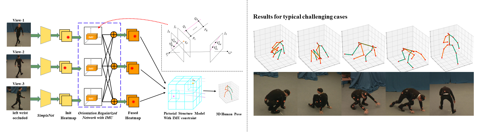

## Biography

I am currently a final-year PhD student in Southeast University, Nanjing, China.

## News

 [**2020-02-24**] Our paper on ***3D human pose estimation from multiview images and IMUs*** is accepted by CVPR 2020!

## Education & Experience
2018/11 - 2020/5  
Research Intern in *Intelligent Multimedia* (IM) Group  
 **Microsoft Research Asia (MSRA)** , Beijing, China  

2014/09 - 2020 (Expected)  
**PhD** candidate in Computer Vision  
 Southeast University (SEU), Nanjing, China  

2010/08 - 2014/06  
B.Eng, School of Instrument Science and Engineering  
 Southeast University (SEU), Nanjing, China  

## Publications

 **Fusing Wearable IMUs with Multi-View Images for Human Pose Estimation: A Geometric Approach**  
<u>Zhe Zhang</u>, Chunyu Wang, Wenhu Qin, Wenjun Zeng  (CVPR 2020)  
 
(Work done at Microsoft Research Asia.)  
[{ Project}](https://www.zhe-zhang.com/cvpr2020),  [{ Paper}](https://arxiv.org/abs/2003.11163),  [{ Code}](https://aka.ms/imu-human-pose)  

## Sites
[Paper Reading](https://www.zhe-zhang.com/paper-reading/)  
[Blog](https://www.zhe-zhang.com/blog/)  

